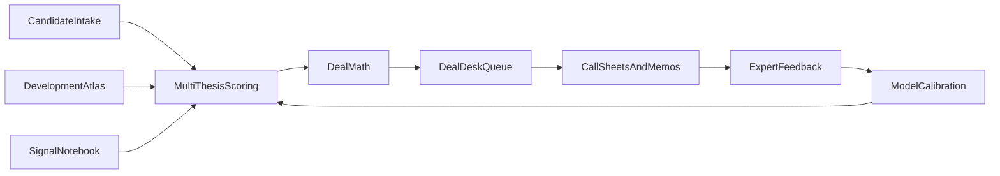

# Land Desk Build Plan

## North Star

Build a **land acquisition operating system**: a private tool that turns raw land opportunities into a ranked, actionable buying queue.

Not “show me parcels.” More like:

> Here are the tracts worth thinking about this week, here is why, here is the likely exit, here is the max price or option structure, here is who to call, and here is what could kill the deal.

The goal is to help find and control asymmetric land opportunities before the market prices in power, water, entitlement, buyer demand, and infrastructure scarcity.

## Money Thesis

The product should optimize for **cheap control over mispriced land optionality**, not perfect prediction.

The tens-of-millions path is:

1. Build a list of 50-100 high-conviction candidates.
2. Kill 80 quickly.
3. Deep diligence 20.
4. Secure cheap control on 3-7.
5. Have 1-2 hit a major infrastructure/development catalyst.
6. Exit the control position, assign the option, sell into a strategic buyer, or JV with a developer.

The tool exists to find the few asymmetric positions where downside is bounded by option/control cost and upside is driven by scarce infrastructure demand.

## Strategic Wedge

The first wedge is **power-led land optionality in 3-5 Indiana nodes**.

Primary lane:

- Data centers
- AI campuses
- Power-heavy industrial users

Secondary / backup lanes:

- Logistics and industrial
- BESS / solar / grid-adjacent land
- Cheap optionable land with multiple plausible exits

The system should support all four lanes, but early scoring, diligence, and expert review should be most rigorous for serveable power.

## Core Operating Loop

The system improves every time we add a candidate, make a call, record an expert rejection, control a parcel, lose a deal, or watch a site become public later.

## What Makes It Unlike A Normal GIS Tool

| Normal parcel tool | Land desk |
|---|---|
| Shows parcels | Tells us which tracts to act on |
| Measures proximity | Underwrites serveability and control |
| One development score | Multi-thesis optionality matrix |
| Pretty map | Deal queue, call sheets, max basis |
| Public data only | Signal notebook and expert feedback |
| No memory | Outcome-labeled land intelligence graph |
| Static shortlist | Weekly acquisition operating cadence |

## Feature Set

### 1. Candidate Intake

A simple way to add real land opportunities before statewide ingestion exists.

Sources:

- County GIS
- Broker emails
- Tax records
- Manually created CSVs
- Parcels found while driving or researching
- Future live parcel feeds

Each candidate stores:

- Parcel ID, county, coordinates
- Acreage and shape notes
- Owner name and owner type
- Asking price or estimated basis
- Broker/source
- Zoning and comp-plan context
- Utility notes
- Road/interstate proximity
- Power/substation/transmission proximity
- Water/sewer notes
- Current status: `new`, `scored`, `researching`, `owner_contacted`, `utility_contacted`, `diligence`, `option_offered`, `under_control`, `rejected`, `watch`
- Last touch date, next action date, responsible person, notes, documents

Acceptance criteria:

- We can add a real parcel in under 5 minutes.
- Candidate intake supports both hand-entered JSON and CSV.
- Imported candidates flow through scoring, mapping, memos, and queue outputs.

### 2. Multi-Thesis Scoring

Every parcel gets scored across multiple possible land theses, not just one.

Four lanes:

- **Power-led:** data center, AI campus, power-heavy industrial
- **Logistics/industrial:** warehouses, factories, supplier parks
- **Energy:** BESS, solar, grid-adjacent land
- **Cheap optionality:** low-cost controllable land with multiple possible exits

Output should not only say “best category.” It should say:

- Primary thesis
- Backup thesis
- Weak theses
- Why now
- What must be proven
- Whether it is still worth watching if the primary thesis fails

Example:

> Primary thesis: power-heavy industrial. Backup thesis: BESS. Weak for logistics. Cheap enough to watch even if the power thesis fails.

### 3. Buy Score

A unified “should we pursue this?” score.

Inputs:

- Development fit
- Infrastructure readiness
- Similarity to past winning sites
- Hiddenness / whether the market has noticed
- Acquisition attractiveness
- Fatal-flaw risk
- Price basis
- Control difficulty
- Confidence

Actions:

- `pursue_now`
- `diligence`
- `watch`
- `pass`

Important change from the prototype:

- Split the current `buy_score` into **site score** and **deal score**.
- Site score asks: “Could this land work?”
- Deal score asks: “Is this land worth trying to control at this price and structure?”

### 4. Deal Desk Queue

The primary artifact should be an action queue, not a ranked parcel list.

Actions:

- `call_owner`
- `call_utility`
- `check_zoning`
- `verify_sewer`
- `add_comps`
- `check_title`
- `ask_broker`
- `order_lidar_review`
- `order_title_check`
- `order_environmental_desktop`
- `watch_only`
- `reject`

Each queue item includes:

- Parcel / assemblage
- Primary thesis
- Backup thesis
- Next action
- Why that action matters
- Fastest kill test
- Cost to answer
- Who should answer it
- Deadline

This makes the system operational: it tells us what to do Monday morning.

### 5. Deal Math

This turns the system from an interesting map into an investment tool.

For each candidate, estimate:

- Current basis per acre
- Likely market value today
- Future exit value if thesis hits
- Downside land value if thesis fails
- Option cost / control cost
- Strike price
- Legal/diligence/survey/engineering spend
- Holding period
- Probability bucket
- Time to signal / catalyst
- Capital at risk
- Probability-adjusted upside
- Max price we should pay
- Preferred control structure

Use ranges and thresholds, not false precision.

Scenario bands:

- Downside: option expires or land reverts to ag/industrial support value
- Base: one credible exit buyer pays controlled-land value
- Upside: scarce powered/entitled site attracts strategic buyer premium

Outputs:

- `max_basis_per_acre`
- `max_option_premium`
- `recommended_strike_price`
- `expected_payoff_band`
- `capital_at_risk`
- `do_not_exceed_price`
- `drop_dead_date`
- `exercise_or_assign_trigger`

Example:

> Max outright basis: $18k/ac. Better structure: 18-month option at $500/ac option premium. Upside case: sell to industrial/data center user at $85k/ac. Downside case: farmland/residential hold at $12k/ac. Verdict: worth optioning, not worth buying outright.

### 6. Control Strategy Engine

Recommend how to control the land.

Options:

- Option agreement
- Assignable purchase agreement
- Right of first refusal
- Right of first offer
- Phased assemblage
- Ground lease
- Lease-option
- Joint venture
- Outright purchase
- Do not control

Inputs:

- Price
- Owner type
- Hiddenness
- Probability of thesis
- Need for assemblage
- Time to entitlement
- Utility uncertainty
- Capital risk
- Legal control score

Output:

> Recommended control: option, not purchase. Reason: high upside if power path clears, but utility uncertainty is too high for fee-simple acquisition.

### 7. Owner Call Sheet

For every promising parcel, generate a human-ready call sheet.

Includes:

- Owner name
- Parcel summary
- What we know
- What we do not know
- Suggested opening angle
- Questions to ask
- Red flags to listen for
- Follow-up action
- What not to reveal
- Market-tipping risk

Example owner questions:

- Would you consider a long-dated option?
- Has anyone approached you about development?
- Any drainage or access issues?
- Any family/title complications?
- Would you sell part of the land?
- Is there a price where you would engage?

### 8. Utility / Infrastructure Call Sheet

For power-led land, the key question is not “is it near a line?” It is “can it actually get served?”

Generate specific questions:

- Who serves this territory?
- Is there available capacity near this substation?
- Is this transmission constrained?
- What load size would trigger upgrades?
- What is realistic: 10 MW, 50 MW, 100 MW, 300 MW?
- Are there queued loads nearby?
- What timeline would service require?
- Are there known interconnection blockers?
- Is phased energization possible?
- What study process, deposit, and timeline applies?
- What usually kills large-load projects in this territory?

Outreach should avoid tipping the market. Ask as a generic confidential industrial site-screening exercise, not as a data-center land acquisition inquiry.

### 9. Serveable Power Model

This is the most important expert-review addition.

Replace “near power” with **MW deliverability underwriting**.

Model:

- MW-by-date feasibility: `10 / 50 / 100 / 250 / 500 MW` at `12 / 24 / 36 / 60 months`
- Firmness: firm, interruptible, phased, contingent on upgrades, speculative
- Upgrade dependency graph: parcel → feeder/substation/transmission path → required upgrades
- Utility confidence grade: public evidence, engineer quote, formal study, signed agreement
- Cost exposure bands: CIAC, network upgrades, substation build, transmission tap, transformer procurement
- Physical feasibility: substation expansion land, ROW, wetlands, zoning, road access for equipment
- Large-load competition risk
- Utility-by-utility playbook

Every power-led memo should answer:

> How many MW, by when, at what cost, with what evidence, and what could break?

### 10. Fatal-Flaw Gates

Every parcel should have explicit kill checks.

Hard gates:

- No legally insurable access
- Seller lacks authority or ownership cannot be controlled
- Existing ROFR/option/lease blocks acquisition
- Required acreage/shape cannot be assembled
- Fatal zoning prohibition with no realistic path
- Utility service impossible within target timeline
- Environmental condition legally prevents intended use
- Title defect cannot be cured or insured over
- Compliance issue: foreign ownership, sanctions, critical infrastructure, anti-corruption

Soft risks:

- Rezoning uncertainty
- Community opposition
- Wetlands mitigation cost
- Utility upgrade cost
- Seller sophistication
- Competing buyer risk
- Minor title exceptions
- Survey discrepancies
- Tax incentive uncertainty
- Permitting duration

The system should say things like:

> Reject unless power path verified.

or:

> Do not call owner until zoning issue is checked.

### 11. Legal Control Score

Site attractiveness and legal/control feasibility must be separate.

Track:

- Title confidence
- Access confidence
- Seller authority confidence
- Zoning confidence
- Environmental confidence
- Utility confidence
- Contract control strength

Contract/control metadata:

- Instrument type: NDA, LOI, option, ROFR, ROFO, PSA, lease-option, easement, access agreement, exclusivity agreement
- Binding / nonbinding
- Exclusive / nonexclusive
- Assignable / nonassignable
- Recordable / nonrecordable
- Option fee
- Purchase price / strike
- Extension fees
- Deposit terms
- Diligence deadline
- Title objection deadline
- Survey deadline
- Utility contingency
- Zoning contingency
- Closing date
- Extension windows
- Termination rights
- Seller cooperation obligations
- Confidentiality and no-shop terms

### 12. Signal Notebook

A structured place to capture proprietary intelligence.

Signals:

- County meeting agenda mentions
- Rezoning pre-meetings
- Sewer expansion studies
- Utility upgrade filings
- MISO queue activity
- IURC large-load hints
- Broker chatter
- Survey crews
- Geotech activity
- Road improvements
- Annexation activity
- Neighboring land sales
- Owner behavior
- New entity purchases
- Consultant or engineering firm activity

Each signal has:

- Date
- Source
- Parcel/node affected
- Confidence
- Impact
- Notes
- Public/private status
- Known-as-of date

This becomes a data moat if it is structured and tied to outcomes.

### 13. Expert Feedback Loop

After talking to experts, log feedback in structured form.

Expert types:

- Utility planner
- Industrial broker
- Land broker
- Civil engineer
- Entitlement attorney
- County official
- Developer
- Appraiser
- Former transmission planner
- Title/survey/environmental specialist

Feedback categories:

- Power rejected
- Sewer rejected
- Access rejected
- Politics rejected
- Price too high
- Owner not realistic
- Site shape bad
- Actually better than model thought
- Already shopped
- Worth monitoring
- Title issue
- Environmental issue
- Buyer fit weak

Rejections are one of the most valuable datasets. They teach the model what “looks good but is bad” means.

### 14. Development Atlas

The Development Atlas is the learning engine.

It tracks:

- Where data centers landed
- Where logistics hubs landed
- Where industrial parks expanded
- Where BESS/solar projects happened
- How long from land control to announcement
- What parcels looked like before public signal
- What infrastructure was nearby
- What changed before development happened
- What buyers, brokers, consultants, and utilities were involved

Core question:

> What did winning land look like before everyone knew it was winning land?

Needed expansion:

- 30-75 real historical projects first
- Then 100+ projects across Indiana/Midwest
- Store land-control date, first public signal date, announcement date, construction start, buyer, utility, acreage, and pre-signal observable features

### 15. Assemblage Builder

Many real opportunities are not one parcel. They are 3-12 parcels that become valuable together.

Find:

- Same-owner clusters
- Adjacent parcels
- Parcels around the same node
- Multi-owner assemblages
- Missing key-parcel blockers
- Total acreage if assembled
- Number of owners
- Likely control complexity
- Minimum viable assemblage
- Expansion assemblage
- Holdout risk
- Owner call order

Example:

> 412-acre possible assemblage, 4 owners, 2 critical parcels, one likely holdout risk.

### 16. Weekly Desk Report

A weekly operating report.

Sections:

- New candidates added
- Top pursue-now parcels
- Parcels needing owner calls
- Parcels needing utility calls
- Parcels killed this week
- Watchlist changes
- New signals
- Biggest open questions
- Best optionable opportunities
- Biggest “do not touch this” warnings
- Options/deals approaching deadlines
- Top catalysts in the next 30/60/90 days

This makes the system something we actually use every Monday.

### 17. Interactive Map

The map is an interface, not the moat, but it should become a decision surface.

Filters:

- Thesis type
- Buy action
- County
- Acreage
- Power readiness
- Hiddenness
- Fatal flaws
- Owner contacted
- Asking price
- Confidence
- Signal count
- Legal/control confidence
- Max basis vs asking price

Layers:

- Parcels
- Assemblages
- Substations
- Transmission
- Highways
- Sewer/water
- Historical projects
- County boundaries
- Zoning
- Flood/wetlands
- Utility territories
- County agenda/catalyst points

### 18. Diligence Memos

For each serious candidate, generate a memo.

Sections:

- Executive verdict
- Primary thesis
- Backup thesis
- Buy score / site score / deal score
- Deal math
- Max basis
- Control recommendation
- Infrastructure path
- Serveable power assessment
- Fatal flaws
- Legal/control risks
- Owner strategy
- Buyer match
- Questions to answer
- Next action
- Kill criteria
- Facts vs assumptions
- Open diligence

This is what we send to ourselves, a partner, broker, lawyer, utility contact, or investor.

### 19. Watchlist / CRM

Track parcel status over time.

Statuses:

- New
- Scored
- Researching
- Owner contacted
- Utility contacted
- Diligence
- Option offered
- Under control
- Rejected
- Watch

Track:

- Last touch date
- Next action date
- Responsible person
- Notes
- Documents
- Expert feedback
- Price changes
- Signals over time
- Contract dates and option deadlines
- Rejection reasons

This becomes a land CRM, not just analytics.

### 20. Comps And Pricing

Add comparable land sales to support the money model.

Features:

- Nearby land sale comps
- Industrial land comps
- Agricultural baseline value
- Entitled land comps
- Powered land comps
- Asking vs likely value
- Per-acre spread
- Implied option value
- Recent sale velocity
- Buyer/seller identity where known

### 21. Alerting

Once live signals exist, alerts make the system proactive.

Examples:

- New IURC filing near watched node
- County agenda mentions sewer expansion near parcel
- Neighboring parcel listed
- MISO queue update near substation
- New industrial announcement within 5 miles
- Owner changed mailing address
- Price dropped
- Option expiration approaching
- Buyer demand signal matches watched parcel

### 22. Buyer Demand Graph

Track who buys what.

Entities:

- Hyperscalers
- Data center developers
- Utilities
- Industrial users
- Logistics developers
- Homebuilders
- Solar/BESS developers
- Infrastructure funds
- Site selectors
- Brokers
- Engineering firms
- Municipalities

Track:

- Where they have bought
- Acreage needs
- MW requirements
- Preferred counties/utilities
- Broker/consultant relationships
- Price tolerance
- Rejected site patterns
- Announcement patterns

Output:

> This tract fits buyers X, Y, and Z. Best exit is power-heavy industrial. Backup is BESS. Weak logistics exit.

### 23. Counterparty Intelligence

Build memory around the humans and organizations that shape land deals.

Track:

- Which brokers move land
- Which LLCs buy near nodes
- Which engineering firms appear in applications
- Which attorneys represent large projects
- Which counties are responsive
- Which utilities support or reject large loads
- Which owners leak, stall, overprice, or close

This becomes a development activity radar.

### 24. Do-Not-Tip-Market Mode

The system should help avoid exposing our own thesis before we control the land.

Features:

- Do not call brokers first if broker exposure will price it in
- Do not ask overly specific utility questions before control
- Use neutral diligence language
- Sequence owner/utility/broker calls safely
- Flag market-tipping risk
- Recommend whether to contact owner before utility or vice versa

### 25. Catalyst Calendar

Track when something could move land value.

Catalysts:

- Utility decision date
- County meeting date
- Rezoning hearing
- MISO queue update
- Road project vote
- Sewer study release
- Option expiration
- Neighboring project announcement
- Incentive approval

Output:

> These five parcels need attention before June because catalysts are coming.

### 26. Option Portfolio Dashboard

Manage controlled land like a venture portfolio.

Track:

- Total option premiums committed
- Total acres controlled
- Total upside case
- Downside exposure
- Probability-weighted value
- Capital at risk
- Time to expiration
- Catalyst calendar
- Concentration by county / utility / thesis
- Deals needing renewal
- Deals to drop
- Correlated exposure by node

Portfolio controls:

- Premium budget by geography, node, and thesis
- Max exposure to one utility territory or county
- Option maturity ladder
- Stage gates before more spend
- Minimum credible buyer count per thesis

### 27. Capital Partner Packet

When a deal is strong, generate a capital-ready packet.

Sections:

- Investment thesis
- Parcel/assemblage map
- Infrastructure path
- Buyer match
- Option/control terms
- Max basis
- Downside/base/upside scenarios
- Diligence checklist
- Remaining risks
- Capital needed
- Proposed structure

## Land Intelligence Graph

The durable moat should be a geo-temporal graph, not just a map.

Entities:

- Parcels
- Assemblages
- Owners
- Brokers
- Buyers
- Utilities
- Municipalities
- Consultants
- Projects
- Permits
- Agenda items
- Signals
- Comps
- Deals
- Options
- Expert feedback
- Outcomes

Every fact should have:

- Source
- Date
- Confidence
- Geometry or related location
- Known-as-of timestamp
- Related entities
- Whether it is public, proprietary, inferred, or expert-sourced

This lets us ask:

> What did we know before the market knew?

## Backtesting And Proof Of Edge

Backtests must be leakage-safe.

For every historical project:

- Freeze time before public announcement.
- Only use facts known as of that date.
- Ask whether the system would have surfaced the land 6, 12, or 18 months earlier.

Metrics:

- Lead time before public signal
- Precision@K
- Winners in top 100
- False-positive cost
- Expert rejection rate
- Buyer match accuracy
- Signal attribution
- Backtest lift versus public-data baseline
- Pursuit conversion: reviewed → pursued → LOI → option/control
- Compounding rate: recommendation improvement after feedback

## Compliance And Ethics Guardrails

The product should support aggressive research without sloppy or illegal behavior.

Guardrails:

- Respect source terms and licensing for county, broker, MLS, vendor, and GIS data.
- Avoid regulated people-data misuse.
- Do not use credit-like data as an eligibility decision.
- Respect DNC/TCPA/CAN-SPAM rules for outreach.
- Avoid misrepresentation in owner calls.
- Avoid fake urgency, fake affiliation, or deceptive market interference.
- Flag potential broker licensing issues.
- Do not present generated contract strategy as legal advice without attorney review.
- Avoid protected-class inference or fair-housing-adjacent scoring.

## Build Order

### Phase 1 — Make It Useful On Real Deals

Goal: score real candidate parcels and turn them into next actions.

Build:

- Candidate intake
- Multi-thesis matrix
- Deal queue
- Owner call sheet
- Utility call sheet
- Weekly desk report

Acceptance:

- Add real parcel in under 5 minutes.
- Every candidate gets a next action.
- Top candidates produce call-ready outputs.
- Weekly report says what to pursue, watch, and kill.

### Phase 2 — Make It Investment-Grade

Goal: know what we can pay, how to control it, and what could kill it.

Build:

- Deal math
- Max basis
- Option premium model
- Scenario bands
- Control strategy engine
- Legal control score
- Expanded fatal-flaw gates
- Diligence memo upgrades

Acceptance:

- Top candidates include max basis and recommended control structure.
- Every candidate has downside/base/upside value bands.
- Memos distinguish facts, assumptions, open diligence, legal risks, and business risks.

### Phase 3 — Make It Compounding

Goal: every call and rejection improves the system.

Build:

- Signal notebook
- Expert feedback loop
- Rejection reason model
- Catalyst calendar
- Counterparty dossiers
- Known-as-of data tracking

Acceptance:

- Every rejection has a structured reason.
- Expert feedback appears in future scoring.
- Signals have source/date/confidence.
- Weekly report highlights new signals and upcoming catalysts.

### Phase 4 — Make It A Moat

Goal: build proprietary intelligence and prove edge.

Build:

- Serveable power model
- Buyer demand graph
- Land intelligence graph
- County agenda watcher
- IURC/MISO watcher
- Option portfolio dashboard
- Backtesting improvements

Acceptance:

- The system can show lead time before public announcements.
- Buyer matching improves exit strategy.
- Portfolio dashboard shows capital at risk, upside, expiry, and concentration.
- Power-led sites are scored by MW-by-date deliverability, not proximity.

### Phase 5 — Scale Geography

Goal: expand only after the workflow works on real candidate deals.

Build:

- IGIO parcel ingestion
- HIFLD transmission/substation ingestion
- County zoning adapters
- Wetlands/flood/topography adapters
- Midwest expansion: Ohio, Michigan, Illinois, Kentucky

Acceptance:

- First 20-50 manually entered candidates have validated the workflow.
- Expert rejection rate is understood and improving.
- We know which signals actually predict useful opportunities.

## Most Valuable Features First

If we prioritize ruthlessly, the first five features are:

1. **Real candidate intake**  
   So we can score real parcels immediately.

2. **Deal queue**  
   So the output tells us what to do, not just what scored high.

3. **Multi-thesis matrix**  
   So land can be valuable for more than one exit.

4. **Deal math / max basis**  
   So we know whether a good site is a good deal.

5. **Expert feedback loop**  
   So every call makes the system smarter.

## Final Form

The mature version is:

> A private land intelligence terminal for finding, evaluating, controlling, and tracking infrastructure-option land before the market catches up.

Daily user experience:

1. Open weekly desk report.
2. Review top opportunities.
3. Make owner and utility calls.
4. Enter feedback.
5. Kill weak deals.
6. Option the best asymmetric ones.
7. Let the system learn from every outcome.

That is the product worth building.
