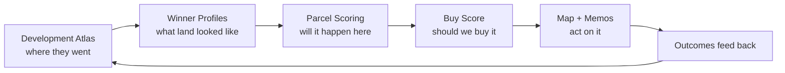

# Master Idea → System Map

Your original idea in one sentence:

> See where data centers and big development go, model the land, use an algorithm to predict the best tracts to buy.

This repo implements that as a **closed loop**, not three separate tools.

## The loop

## 1. See where development goes

**Module:** `atlas/development_atlas.py`  
**Outputs:** `development_atlas.json`, `development_atlas_report.md`, historical project points on `map.html`

Tracks known projects by category, county, acreage, and timeline (land control → first public signal → announcement). This is the retrospective “where do data centers and factories actually land?” layer.

## 2. Model the land

**Modules:** `scoring/nodes.py`, `scoring/parcels.py`, `scoring/assemblage.py`  
**Outputs:** node scores, fit scores, power/water/entitlement, fatal-flaw gates, assemblages

Models *places* (infrastructure nodes) and *land* (parcels + multi-parcel assemblages) using the same constraints real developers face: power MW tiers, sewer path, zoning, wetlands, access, politics.

## 3. Predict best tracts to buy

**Modules:** `atlas/patterns.py`, `scoring/buy_score.py`  
**Outputs:** `buy_watchlist.json`, `ranked_parcels.json` sorted by **buy_score**

| Score | Meaning |
|-------|---------|
| **profile_match** | How similar this parcel is to land that *already* won (historical winners) |
| **composite** | Forward prediction: fit + infrastructure + signals |
| **buy_score** | Action score: prediction × acquisition × hiddenness × fatal flaws |

**Buy actions:** `pursue_now` → `diligence` → `watch` → `pass`

This is the direct answer to “what should I buy?” — not just “where might something get built?”

## 4. See it on a map

**Module:** `export/map_html.py`  
**Output:** `outputs/map.html` (open in browser)

- Blue = infrastructure nodes  
- Purple = historical projects (where big dev went)  
- Green/yellow/gray = candidate parcels by buy action  

## What makes it stronger than a heat map

| Generic “dev prediction” | This system |
|--------------------------|-------------|
| Likelihood of development | **Buy score** with control path |
| Public GIS only | Signal layer (IURC, MISO, meetings) |
| Single parcels | **Assemblages** (multi-owner land plays) |
| No history | **Development atlas** learns from winners |
| Pretty map | **Diligence memos** + evidence packs |

## Next leap to full power

1. **Live Indiana parcels** (IGIO) — replace 14 sample tracts with ~millions  
2. **30–75 real projects** in atlas — train profiles on actual footprints  
3. **Signal ingestion** — auto-boost when IURC/MISO/county agenda hits  
4. **ML layer** — gradient model on parcel-time store (optional; transparent scores stay)  

Run the loop: `land-model run` → open `outputs/map.html` → read `outputs/buy_watchlist.json`
